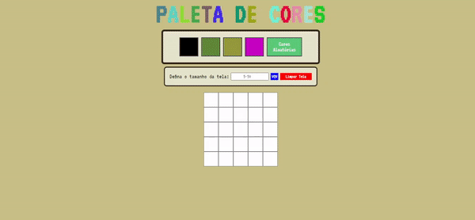

# Projeto Pixel Art

Nesse projeto desenvolvi uma página web que contem uma paleta de cores funcional que será utilizada para criar art em pixel. O usuário poderá definir o tamanho da tela como também gerar cores aleatórias. 

[Testar Projeto](https://jonathankarlinski.github.io/pixels-art/)

## Conhecimentos Utilizados

- HTML
- CSS
- Java Script
- Document Object Model (DOM)

## Demonstração

## Feedback

Se você tiver algum feedback, posso ser encontrado em

  
  